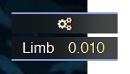
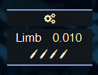
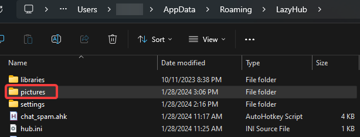

<p align="center">
  
  <h1 align="center">LazyWorld</h1>
  <p align="center">AHK is a versatile tool that can be used for a wide range of automation tasks :)</p>
</p>

## [🔗 Download LazyHub](https://github.com/Lazy-World/warframe-ahk/blob/LazyHub/LazyHub/LazyHubSetup.exe)
> Version: 3.0.8
---

# 📝Contents
- [Fonts](#%EF%B8%8F-fonts)
  - [Download links](#download-links)
- [Preview](#-preview)
- [Pictures](#%EF%B8%8F-pictures)
  - [Usage](#usage) 

## 🖊️ Fonts
### - [Downdoad](https://github.com/Lazy-World/warframe-ahk/raw/main/attachments/Fonts/fonts.zip): **All fonts I use in my scripts**

---

# 🔮 Preview
> `vs_propa_raplak.ahk` & `vs_propa_zenith.ahk`
- **Main UI** 

  

- **Anti-desync enabled** (bullet count == remaining shots)

  

- **State indicator** 

  

- **Warnings** (EN == not english)

  

[Back to TOC](#contents)

---

## 🖼️ Pictures

### Usage
- Go to `%appdata%\LazyHub` and create `pictures` folder

  

- Create your script
  ```ahk
  ; Setup sizes
  global picture_pos          := new Vector(x_position, y_position)
  global picture_size         := new Vector(width, height)
  
  ; Create picture
  ; 2D_2.png should be located in pictures path !!
  pic_1                       := new Picture("pic_1", "2D_2.png", picture_pos, picture_size)
  
  ; Render your picture
  pic_1.show()
  ```
[Back to TOC](#contents)
