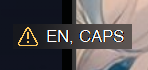

<p align="center">
  
  <h1 align="center">LazyWorld</h1>
  <p align="center">AHK is a versatile tool that can be used for a wide range of automation tasks :)</p>
</p>

# 📝Contents
- [Fonts](#%EF%B8%8F-fonts)
  - [Download links](#download-links)
- [Preview](#-preview)
- [Pictures](#%EF%B8%8F-pictures)
  - [Usage](#usage)
- [Libraries](#-libraries)
  - [Installation](#installation)
  - [Game settings library](#game-settings-library)

---
## [🔗 Download LazyHub](https://github.com/Lazy-World/warframe-ahk/blob/LazyHub/LazyHub/LazyHubSetup.exe)
> Version: 3.0.8
---
 

## 🖊️ Fonts

### Download links
- [All Fonts](./attachments): All fonts I use in my scripts
- [JetBrainsMono](./attachments/Fonts/JetBrainsMono-Medium.ttf): "**JetBrains Mono Medium**" in *.ahk file
- [Montserrat](./attachments/Fonts/Montserrat-Medium.otf): "**Montserrat Medium**" in *.ahk file

[Back to TOC](#contents)

---

# 🔮 Preview
> `vs_propa_raplak.ahk` & `vs_propa_zenith.ahk`
- **Main UI** 

  

- **Anti-desync enabled** (bullet count == remaining shots)

  

- **State indicator** 

  

- **Warnings** (EN == not english)

  

[Back to TOC](#contents)

---

## 🖼️ Pictures

### Usage
- Go to `%appdata%\LazyHub` and create `pictures` folder

  

- Create your script
  ```ahk
  ; Setup sizes
  global picture_pos          := new Vector(x_position, y_position)
  global picture_size         := new Vector(width, height)
  
  ; Create picture
  ; 2D_2.png should be located in pictures path !!
  pic_1                       := new Picture("pic_1", "2D_2.png", picture_pos, picture_size)
  
  ; Render your picture
  pic_1.show()
  ```
[Back to TOC](#contents)

---

## 📦 Libraries

### Installation

- Copy library files to **[ %AppData%/LazyHub/lib ]** path (this is a **default** lib path that I use in all scripts)

### Game settings library

- Open **Warframe** then open InGame settings (**ESC -> Options -> KEYBOARD/MOUSE -> Customize Key Binds**)
- Open **game_settings.ahk** by any code editor
- All KeyBinds are separeted by groups. If you see `; Description` near KeyBind it means than you can find it in game settings with the same name
  - **[Control keys]** section contains main keybinds
  - **[Abilities]** section is responsible for **Abilities**
  - **[WASD Keys]** section is responsible for (yes, **WASD** keys)
  - **[Gear Hotkeys]** section is responsible for binds in **Gear**
  - **[RTSS binds for FPS]** section is responsible for `FPS cap`

[Back to TOC](#contents)

