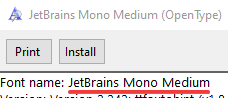
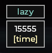

<p align="center">
  
  <h1 align="center">LazyWorld</h1>
  <p align="center">AHK is a versatile tool that can be used for a wide range of automation tasks :)</p>
</p>

# Contents 🚀
- [Libraries](#-libraries)
  - [Installation](#installation)
  - [Game settings library](#game-settings-library)
- [Fonts](#%EF%B8%8F-fonts)
  - [Download links](#download-links) 
  - [Font setup](#font-setup)
  - [Step by Step instruction](#%EF%B8%8F-step-by-step-instruction)
  - [Preview](#preview)
  
## 📦 Libraries

### Installation

- Copy library files to **[ %AppData%/LazyHub/lib ]** path (this is a **default** lib path that I use in all scripts)

### Game settings library

- Open **Warframe** then open InGame settings (**ESC -> Options -> KEYBOARD/MOUSE -> Customize Key Binds**)
- Open **game_settings.ahk** by any code editor
- All KeyBinds are separeted by groups. If you see `; Description` near KeyBind it means than you can find it in game settings with the same name
  - **[Control keys]** section contains main keybinds
  - **[Abilities]** section is responsible for **Abilities**
  - **[WASD Keys]** section is responsible for (yes, **WASD** keys)
  - **[Gear Hotkeys]** section is responsible for binds in **Gear**
  - **[RTSS binds for FPS]** section is responsible for `FPS cap`

[Back to TOC](#contents-)

---
  
## 🖊️ Fonts

### Download links
- [JetBrainsMono](https://github.com/Lazy-World/warframe-ahk/raw/main/attachments/Fonts/JetBrainsMono-Medium.ttf): "**JetBrains Mono Medium**" in *.ahk file
- [Montserrat](https://github.com/Lazy-World/warframe-ahk/raw/main/attachments/Fonts/Montserrat-Medium.otf): "**Montserrat Medium**" in *.ahk file

### Font setup

1. Download and install any font you want
1. Open [**.ttf** or **.otf**] and copy **"Font name:"**
1. Open script file and edit **["title", "main", "info"]**

### ⚙️ Step by Step instruction

- [Download font](#download-links) then find "Font name" field and copy font's name

  

- Open script and select Font names for each category. In my case I use **Montserrat Medium** for each category
  ```ahk
  ui_theme.insert("title", "Montserrat Medium")
  ui_theme.insert("main",  "Montserrat Medium")
  ui_theme.insert("info",  "Montserrat Medium")
  ```
- Run or reload script file.

### Preview

- **JetBrainsMono** Font preview of **UI** in **vs_propa_raplak.ahk**

  

- **Montserrat** Font preview of **UI** in **vs_propa_raplak.ahk**

  

[Back to TOC](#contents-)

---
